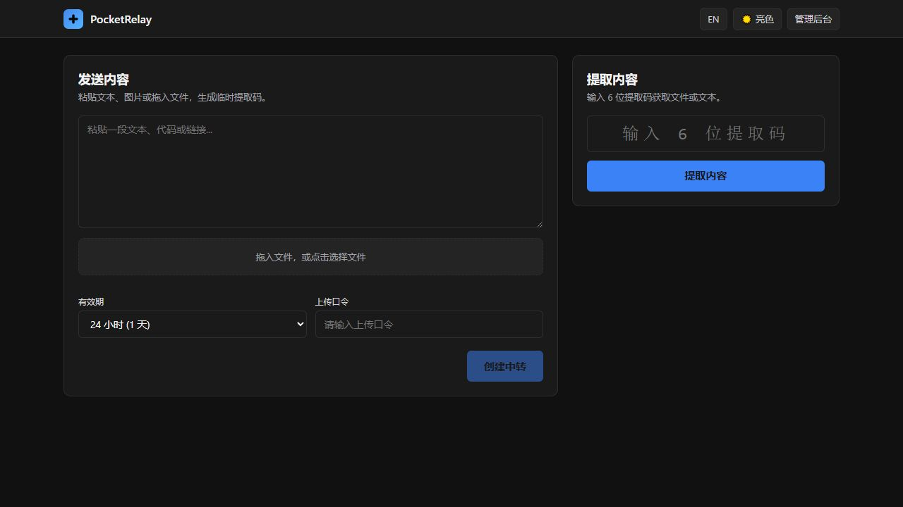
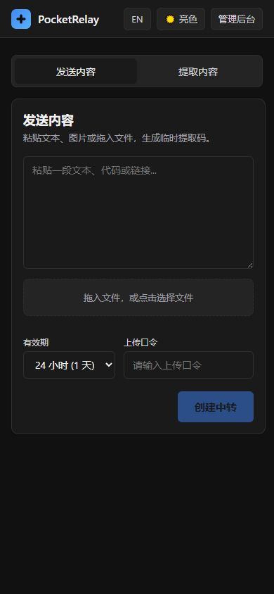
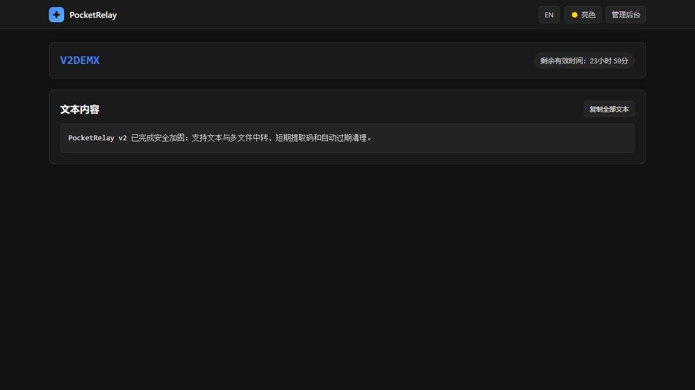

# PocketRelay v2

[简体中文](README.md) | [English](README.en.md)

A private cross-device content relay: copy something, switch devices, enter a retrieval code, and take it with you.

PocketRelay v2 is a self-hosted Cloudflare Workers application. One Worker serves the API, static assets, and scheduled cleanup. D1 stores metadata, while private R2 storage holds files and large text.



<details>
<summary>More screenshots</summary>

| Mobile home page | Retrieved content |
|---|---|
|  |  |

</details>

## Features

- **Text and multiple files:** one text item up to 5 MiB and up to 10 files, with a 50 MiB per-file and 500 MiB aggregate limit.
- **Direct browser uploads:** short-lived presigned PUT URLs send files directly to an isolated area in private R2 storage.
- **Safe finalization:** the Worker validates the staged object and writes an independent finalized object, so an old upload URL cannot overwrite committed content.
- **Tiered text storage:** text up to 1 MiB is stored in D1; larger text is streamed from private R2.
- **Retrieval codes:** six characters by default, configurable from five to eight, with share links and QR codes.
- **Real-time expiry:** expired content returns HTTP 410 immediately, without waiting for scheduled cleanup.
- **Two upload modes:** public upload or token-gated upload; risky scripts and executables are blocked by default in public mode.
- **iOS Shortcuts endpoint:** push text using a Bearer token.
- **Admin console:** session login, overview metrics, expiry extension, revocation, deletion, and settings.
- **Automatic cleanup:** bounded scheduled cleanup for abandoned drafts, expired drops, revoked records, and orphaned objects.
- **Native front end:** Vite, TypeScript, and CSS with Chinese and English locales, themes, and responsive layouts.

## Architecture

```text
Browser
  ├─ Static pages and assets ───────────> Worker Static Assets
  ├─ Metadata, text, auth, retrieval ───> Hono Worker API
  └─ File bytes ── Presigned PUT ───────> Isolated private R2 upload area

Hono Worker
  ├─ D1: Drops, Files, DropItems, Settings, AdminSessions, ObjectDeletions
  ├─ R2: staged-object validation, finalization, private files, large text
  ├─ aws4fetch: presigned PUT URLs with a maximum 300-second lifetime
  ├─ Rate Limit: admin login, uploads, Shortcuts, and retrieval
  └─ Scheduled Cron: two-phase deletion with retry backoff
```

## Local development

Node.js and npm are required.

```bash
git clone https://github.com/rowanjove/pocket-relay.git
cd pocket-relay
npm ci
cp .dev.vars.example .dev.vars
```

Set development-only values in `.dev.vars`:

```env
ADMIN_PASSWORD=your-local-admin-password
UPLOAD_TOKEN=your-local-upload-token
SHORTCUT_TOKEN=your-local-shortcut-token
R2_ACCESS_KEY_ID=your-r2-s3-access-key-id
R2_SECRET_ACCESS_KEY=your-r2-s3-secret-access-key
R2_ACCOUNT_ID=your-cloudflare-account-id
R2_BUCKET_NAME=pocket-relay-files
```

Apply migrations and start the app:

```bash
npm run db:migrate:local
npm run check
npm run dev
```

Keep local and production secrets separate, and never commit `.dev.vars`.

## Deploying to Cloudflare

Deployment creates or changes cloud resources. Back up D1 and R2 before upgrading an existing installation.

### 1. Prepare resources

```bash
npx wrangler d1 create pocket-relay
npx wrangler r2 bucket create pocket-relay-files
```

Copy the D1 `database_id` into `wrangler.jsonc` and confirm that the R2 bucket name matches your configuration.

### 2. Configure R2 CORS

Replace `https://drop.example.com` in `cors.json` with the exact production origin, then run:

```bash
npx wrangler r2 bucket cors set pocket-relay-files --file cors.json
```

### 3. Configure production secrets

```bash
npx wrangler secret put ADMIN_PASSWORD
npx wrangler secret put UPLOAD_TOKEN
npx wrangler secret put SHORTCUT_TOKEN
npx wrangler secret put R2_ACCESS_KEY_ID
npx wrangler secret put R2_SECRET_ACCESS_KEY
npx wrangler secret put R2_ACCOUNT_ID
```

### 4. Migrate and deploy

```bash
npm run db:migrate:remote
npm run deploy:dry
npm run deploy
```

`deploy:dry` rejects placeholder resource IDs, the example CORS origin, excessive presigned URL lifetimes, and accidentally tracked secret files.

After deployment, check `GET /api/v1/ready`, the home page, drop creation and retrieval, and file downloads. Run the one-time legacy-table removal only after v2 is healthy and your backup is usable:

```bash
npm run db:remove-v1:remote
```

### 5. R2 lifecycle safety net

Configure an R2 lifecycle rule to delete objects after eight days. The maximum application lifetime is seven days; the extra day makes this a safety net for orphaned objects without shortening valid drops.

## iOS Shortcuts example

```http
POST /api/shortcut/push
Authorization: Bearer YOUR_SHORTCUT_TOKEN
Content-Type: application/json

{"content":"https://developers.cloudflare.com/","expiresInSeconds":86400}
```

`text/plain` bodies are also supported. The token must be sent in the Authorization header; query-string tokens are not accepted.

## API overview

| Method | Path | Purpose | Access |
|---|---|---|---|
| `GET` | `/api/v1/health` | Process health | Public |
| `GET` | `/api/v1/ready` | Database, binding, and secret readiness | Public |
| `GET` | `/api/v1/meta` | Site metadata and limits | Public |
| `POST` | `/api/v1/drops` | Create a draft | Upload-mode dependent |
| `PUT` | `/api/v1/drops/:dropId/text` | Write or replace draft text | Draft token |
| `POST` | `/api/v1/uploads/prepare` | Request a direct-upload URL | Draft token |
| `POST` | `/api/v1/uploads/complete` | Validate and finalize an upload | Draft token |
| `POST` | `/api/v1/drops/:dropId/commit` | Commit and create a retrieval code | Draft token |
| `GET` | `/api/v1/drops/:code` | Retrieve a drop | Retrieval code |
| `GET` | `/api/v1/files/:fileId/content` | Download or preview a file | Valid drop |
| `POST` | `/api/shortcut/push` | Push from iOS Shortcuts | Bearer token |
| `POST` | `/api/v1/admin/login` | Admin login | Admin password |
| `POST` | `/api/v1/admin/logout` | Revoke the current session | Admin session |
| `POST` | `/api/v1/admin/logout-all` | Revoke every session | Admin session |

## Privacy and limitations

- Text and files are stored server-side during their lifetime; PocketRelay is not end-to-end encrypted storage.
- Retrieval codes are intended for temporary sharing, not as strong access control or a sole backup.
- A presigned URL is a Bearer credential until it expires. Clients must not log or forward it.
- Deletion is asynchronous at the application layer and does not promise simultaneous physical erasure from every cloud backup.
- Never commit `.dev.vars`, API tokens, account credentials, or real Shortcut tokens.

## Version and license

- [Changelog](CHANGELOG.md)
- [v2.0.0 release notes](release/RELEASE_NOTES_v2.0.0.md)
- [MIT License](LICENSE)
